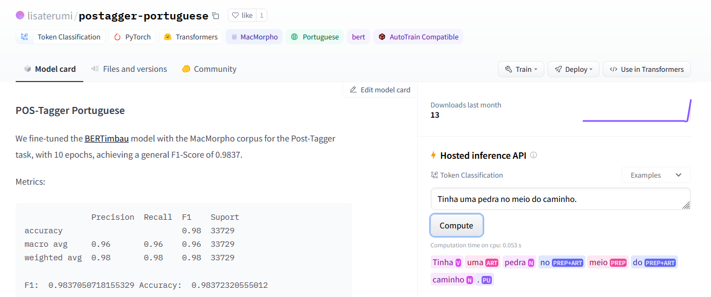

# NLP Portuguese POS-tagger

Treinamos o modelo [BERTimbau](https://github.com/neuralmind-ai/portuguese-bert/) com o corpus [MacMorpho](http://nilc.icmc.usp.br/macmorpho/) para tarefa de *POS-Tagger*, com 10 épocas, atingindo um *F1-Score* geral de `0.9837`.

Metricas:

```
              Precision  Recall  F1    Suport
accuracy                         0.98  33729
macro avg     0.96       0.96    0.96  33729
weighted avg  0.98       0.98    0.98  33729

F1:  0.9837050718155329 Accuracy:  0.98372320555012
```

## Repositório

Nosso modelo está no repositório oficial do `Hugging Faces`, você pode acessá-lo pelo endereço: https://huggingface.co/lisaterumi/postagger-portuguese/



Se você gostou do nosso trabalho, não se esqueça de dar um *like* no modelo no `Hugging Faces` ❤️

## Como usar

Para usar nosso modelo, basta seguir os passos abaixo:

```
from transformers import AutoTokenizer, AutoModelForTokenClassification

tokenizer = AutoTokenizer.from_pretrained("lisaterumi/postagger-portuguese")

model = AutoModelForTokenClassification.from_pretrained("lisaterumi/postagger-portuguese")

```

Aqui você tem um manual dos tipos gramaticais retornados pelo modelo: http://nilc.icmc.usp.br/macmorpho/macmorpho-manual.pdf
